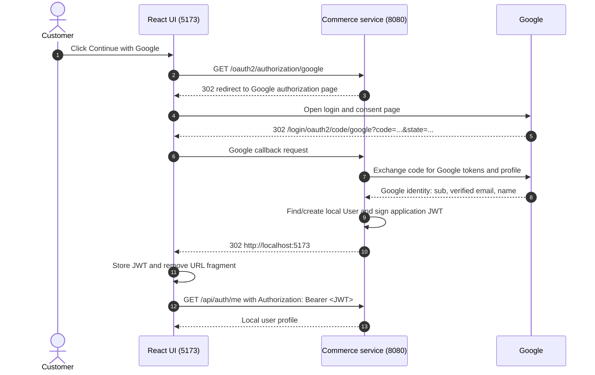

# Google OAuth and JWT Flow

This demo uses Google only to verify the customer's identity. After that succeeds, the backend issues its own one-hour JWT for the ecommerce API.



## Detailed request-by-request flow

1. The customer clicks **Continue with Google** in React.

   The button runs:

   ```js
   window.location.assign(api.googleLoginUrl)
   ```

   `api.googleLoginUrl` is:

   ```text
   http://localhost:8080/oauth2/authorization/google
   ```

   This is a full browser navigation, not a `fetch()` API call.

2. The browser sends:

   ```http
   GET /oauth2/authorization/google
   Host: localhost:8080
   ```

3. Spring Security receives the request before controllers. `OAuth2AuthorizationRequestRedirectFilter` matches:

   ```text
   /oauth2/authorization/{registrationId}
   ```

   It sees `registrationId = google`.

4. The filter looks up the `google` client registration from `application-local.yml`:

   ```yaml
   client-id: ...
   client-secret: ...
   scope: openid, profile, email
   ```

   It creates an OAuth authorization request containing the client ID, requested scopes, callback address, and a random `state` value. Spring stores the temporary request and `state` in a backend session.

5. Spring responds directly to the browser with an HTTP redirect to Google's authorization endpoint. The URL includes the callback URI, so Google knows where to return the browser after authentication:

   ```http
   HTTP/1.1 302 Found
   Location: https://accounts.google.com/o/oauth2/v2/auth?
     client_id=...
     &redirect_uri=http://localhost:8080/login/oauth2/code/google
     &response_type=code
     &scope=openid%20profile%20email
     &state=random-value
   ```

   The browser automatically follows `Location` and opens Google's sign-in/consent page. Google accepts the request only when `redirect_uri` exactly matches an Authorized redirect URI configured for the Google OAuth client.

6. The customer signs in to Google and accepts the requested identity scopes.

7. Google redirects the browser to Spring's callback; no JavaScript is involved:

   ```http
   GET /login/oauth2/code/google?code=...&state=...
   Host: localhost:8080
   ```

8. Spring Security's `OAuth2LoginAuthenticationFilter` handles the callback. It verifies `state` against the value in the temporary session. Then the backend, not the browser, sends the authorization code to Google's token endpoint:

   ```text
   Backend -> Google token endpoint: code + client ID + client secret + redirect URI
   Google -> Backend: Google access token and OpenID Connect ID token
   ```

   Because this login requests `openid`, `profile`, and `email`, Spring Security obtains the Google identity claims (`sub`, verified email, and name) from the OpenID Connect response. Depending on the provider configuration, it can also call Google's UserInfo endpoint with Google's access token to retrieve profile claims. These Google tokens are used only to complete Google authentication; they are not sent to React as the application's login token.

9. The authentication succeeded, so Spring invokes the handler configured in `SecurityConfig`:

   ```java
   http.oauth2Login(oauth -> oauth.successHandler(googleAuthenticationSuccessHandler)
   );
   ```

10. `googleAuthenticationSuccessHandler` calls:

    ```java
    authService.loginWithGoogle(subject, email, name)
    ```

11. `AuthService` finds the local user by `("google", subject)`. If it does not exist, it links an existing local account with the same email or creates a new local `User`. It saves the Google provider and subject on the user record.

12. `AuthService.loginWithGoogle(...)` builds its response by calling:

    ```java
    jwtService.createToken(user.getId())
    ```

    This creates the application's own JWT. It is not Google's access token or ID token. It is signed with `app.jwt-secret`, expires after one hour, and has the local user ID as its JWT subject.

13. The success handler gets the `accessToken` from the login response, invalidates the temporary OAuth session, and redirects the browser to React:

    ```http
    HTTP/1.1 302 Found
    Location: http://localhost:5173#access_token=<application-jwt>
    ```

14. The browser follows the redirect back to React. The URL fragment is not included in an HTTP request to the frontend server.

15. React reads the fragment:

    ```js
    new URLSearchParams(window.location.hash.slice(1))
      .get('access_token')
    ```

    React stores the JWT in `localStorage` and removes the fragment from the address bar.

16. React requests the signed-in user:

    ```http
    GET /api/auth/me
    Authorization: Bearer <application-jwt>
    ```

17. `JwtAuthenticationFilter` runs before the controller. It reads the bearer token, validates its signature and expiration with `JwtService`, extracts the local user ID from its subject, and places that ID in Spring Security's `Authentication` object. `AuthController` uses that ID to return the local user profile.

18. React stores the local user in application state and renders the signed-in UI. Every later protected API call, including checkout, sends the same bearer JWT. `CheckoutController` also verifies that the JWT user ID matches the checkout request's user ID.

## Session versus JWT

Spring temporarily uses a session during the Google authorization-code exchange to store and verify the OAuth `state` value. Once Google login succeeds, the success handler invalidates that temporary session. Subsequent API authentication uses the application's JWT bearer token.

## Demo limitation

This demo stores the JWT in `localStorage` and transports it in the redirect fragment for clarity. A production application should generally use a short-lived one-time exchange code or secure HttpOnly cookies to reduce exposure to XSS.
