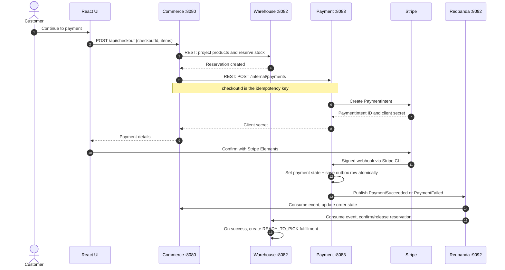

# Stripe Payment Process Flow



## Important behavior

- Commerce calculates the amount from its own catalog; the browser never supplies the amount.
- Payment owns Stripe API keys, PaymentIntent records, webhook verification, and the outbox.
- Stripe's webhook is the source of truth for final payment status.
- The payment outbox makes the database update and the intent to publish an event atomic. Publishing is at-least-once, so both Commerce and Warehouse store processed event IDs to ignore duplicates.
- Repeating checkout with the same `(userId, checkoutId)` reuses the Commerce order and the existing Stripe PaymentIntent.

## Local webhook forwarding

```bash
stripe listen --forward-to localhost:8083/api/stripe/webhook
```

Place the signing secret printed by Stripe CLI only in Payment's ignored local configuration. The public `application.yml` reads it from `STRIPE_WEBHOOK_SECRET` in non-local environments.
