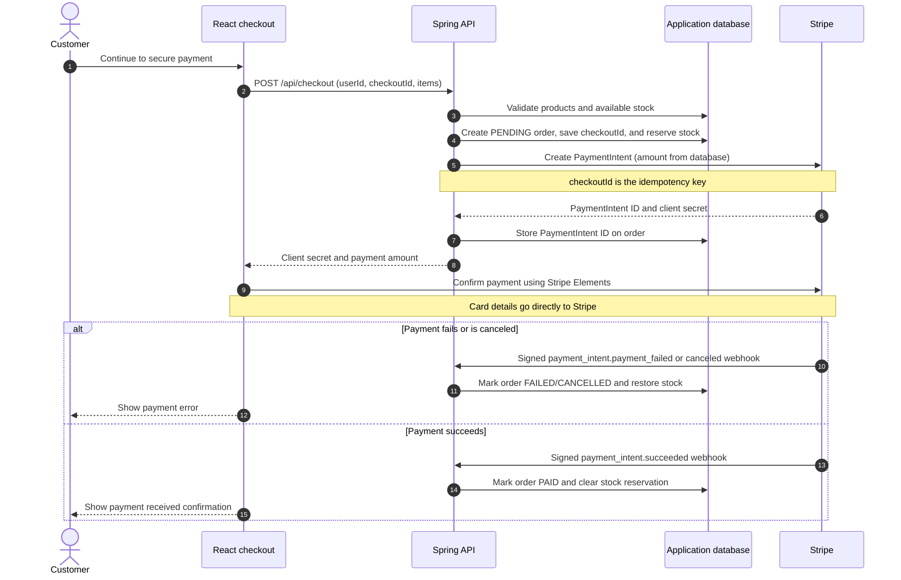

# Stripe Payment Process Flow

## Important behaviour

- The API calculates the amount from its own product database; the browser never supplies the charge amount.
- The Stripe webhook is the source of truth for the final order status.
- Repeated checkout requests with the same `(userId, checkoutId)` reuse the same local order and Stripe PaymentIntent; stock is reserved only once.

## How the Stripe payment lifecycle works

1. The client calls the backend to begin checkout.
2. The backend creates a pending order, calculates the total from its database, and asks Stripe to create a `PaymentIntent`.
3. Stripe returns a PaymentIntent ID and client secret. The backend stores the ID on the order and returns the client secret to the client.
4. The customer enters card details in Stripe Elements. Stripe.js sends those details directly to Stripe and confirms the payment; card data never passes through this backend.
5. The client can show that payment was received or is processing, and the customer may leave the page. The browser is not the final authority on the order status.
6. Stripe processes the payment and sends a signed webhook event to the backend.
7. The backend verifies the webhook signature, finds the order using the PaymentIntent ID, and updates the database:
   - `payment_intent.succeeded` marks the order as `PAID`.
   - `payment_intent.payment_failed` or `payment_intent.canceled` marks the order as failed/cancelled and restores reserved stock.

The webhook is essential because the customer can close the page, lose connectivity, or return later while Stripe still completes the payment asynchronously.
